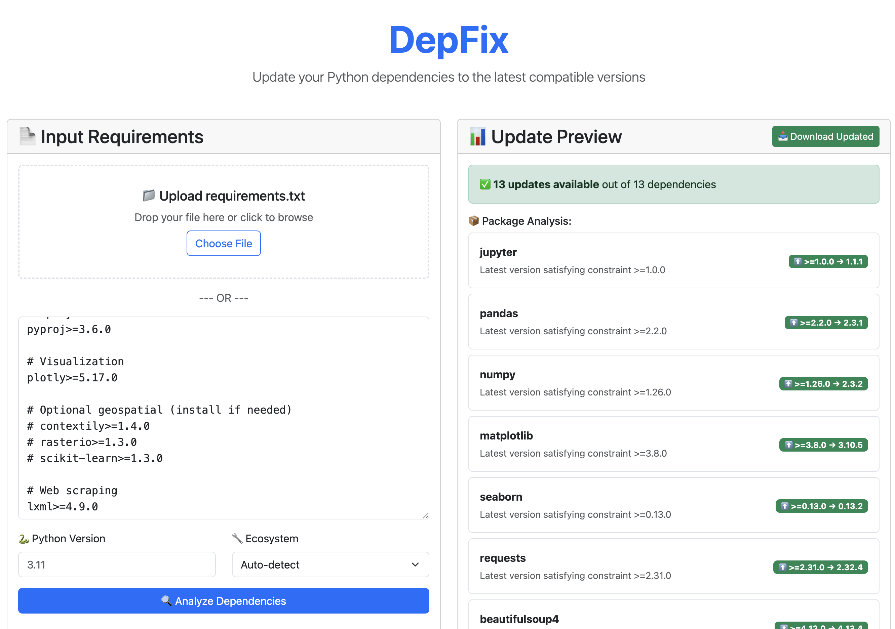

# DepFix



> **Update dependency manifests to latest compatible versions**

DepFix is a command-line tool and web application that automatically updates Python `requirements.txt` files to use the latest compatible package versions. Perfect for rapid prototyping environments where you need fresh dependencies without the overhead of dependency bots like Renovate or Dependabot.

## Features

- **🚀 Instant Updates**: Paste a requirements.txt → get latest compatible versions
- **🌐 Web Interface**: Drag-and-drop file uploads with live preview
- **⚡ Fast Resolution**: Async processing with PyPI integration
- **🧠 Smart Constraints**: Respects version specifiers and requirements
- **📊 Clear Reporting**: Visual diff and detailed change summaries
- **🛡️ Safe Testing**: Dry-run mode for preview before changes
- **📋 Multiple Formats**: CLI output in table or JSON format

## Quick Start

### Installation

```bash
# Clone the repository
git clone <repository-url>
cd depfix

# Install with uv (recommended)
curl -LsSf https://astral.sh/uv/install.sh | sh
uv sync

# Or with pip
pip install -e .
```

### CLI Usage

```bash
# Update requirements.txt in place
depfix requirements.txt

# Web interface
python start_web.py
# Then open http://localhost:8000
```

## Examples

### CLI Examples

```bash
# Update a requirements file in place
depfix update requirements.txt -i

# Preview changes without writing
depfix update requirements.txt --dry-run

# Output to new file
depfix update requirements.txt --out requirements-updated.txt

# JSON output for scripting
depfix update requirements.txt --format json --dry-run
```

### Web Interface

1. **Upload File**: Drag and drop your `requirements.txt`
2. **Analyze**: Click "Analyze Dependencies" 
3. **Review**: See package-by-package updates with version changes
4. **Download**: Get the updated requirements file

## Project Structure

```
depfix/
├── apps/                   # Applications
│   ├── cli/               # Command-line interface
│   └── web/               # FastAPI web application
├── core/                   # Core functionality
│   ├── detect.py          # Ecosystem detection
│   ├── models.py          # Data models
│   ├── parse_python.py    # Requirements.txt parser
│   └── resolve_python.py  # Package resolution
├── tests/                  # Test suite
├── docs/                   # Documentation
├── examples/               # Example files and scripts
└── start_web.py           # Web app launcher
```

## Development

### Running Tests

```bash
# Run all tests
uv run pytest

# Run with coverage
uv run pytest --cov=core --cov=apps

# Run specific test file
uv run pytest tests/unit/test_web.py
```

### Code Quality

```bash
# Format code
uv run ruff format

# Lint code
uv run ruff check

# Type checking
uv run mypy core apps
```

### Development Server

```bash
# Start web application with hot reload
python start_web.py

# Or directly with uvicorn
uv run uvicorn apps.web.main:app --reload
```

## CLI Reference

### Commands

- `depfix update <file>` - Update dependency manifest file

### Options

- `-i, --in-place` - Edit files in place
- `--out <path>` - Output to specific file or directory
- `--dry-run` - Preview changes without writing files
- `--format <table|json>` - Output format (default: table)
- `--python <version>` - Target Python version (e.g., 3.11)
- `--ecosystem <auto|python>` - Force ecosystem detection

### Exit Codes

- `0` - Success, files updated
- `2` - No changes needed (already up-to-date)  
- `4` - Parse error (malformed file)
- `5` - Resolver error (network/package issues)

## Web API

The web application provides REST endpoints:

- `GET /` - Web interface
- `POST /api/update` - Analyze requirements from text
- `POST /api/upload` - Upload and analyze requirements file
- `POST /api/download` - Download updated requirements file

See `/docs` for interactive API documentation.

## Example Output

### CLI Table Format

```
Package     Current    New        Change
─────────   ─────────  ─────────  ──────
fastapi     >=0.85.0   0.115.0    minor
requests    >=2.28.0   2.32.4     minor
pandas      ^1.4.0     2.2.3      major
```

### JSON Format

```json
{
  "ecosystem": "python",
  "has_changes": true,
  "changes": [
    {
      "name": "fastapi",
      "current_version": ">=0.85.0",
      "new_version": "0.115.0",
      "reason": "Latest version satisfying constraint",
      "semver_delta": "minor",
      "has_change": true
    }
  ],
  "updated_content": "fastapi==0.115.0\nrequests==2.32.4\n"
}
```

## Use Cases

### Rapid Prototyping
- Update AI-generated requirements files
- Refresh stale dependency lists
- Get latest compatible versions quickly

### Development Workflows
- Update dependencies before major releases
- Batch update multiple requirements files
- Generate reports for security/compliance

### CI/CD Integration
- JSON output for automated processing
- Exit codes for pipeline decisions
- Dry-run mode for PR validation

## Architecture

DepFix uses a modular architecture:

1. **Detection**: Identify ecosystem (Python, Node.js) from file content
2. **Parsing**: Extract packages and constraints while preserving formatting
3. **Resolution**: Query package registries for latest compatible versions
4. **Analysis**: Compare versions and generate change reports
5. **Output**: Generate updated files with preserved structure

### Key Technologies

- **Python 3.11+** with async/await
- **FastAPI** for web interface
- **Typer** for CLI framework
- **httpx** for async HTTP requests
- **packaging** for PEP 440 version handling
- **Bootstrap 5** for responsive UI

## Contributing

1. Fork the repository
2. Create a feature branch (`git checkout -b feature/amazing-feature`)
3. Make your changes
4. Add tests for new functionality
5. Run the test suite (`uv run pytest`)
6. Commit your changes (`git commit -m 'Add amazing feature'`)
7. Push to the branch (`git push origin feature/amazing-feature`)
8. Open a Pull Request

## Documentation

- [Architecture Overview](docs/CLAUDE.md)
- [CLI Specifications](docs/CLI_SPECS.md)
- [MVP Plan](docs/MVP_PLAN.md)
- [API Documentation](http://localhost:8000/docs) (when running)

## License

This project is licensed under the MIT License - see the LICENSE file for details.

## Acknowledgments

- Built with modern Python async/await patterns
- UI powered by Bootstrap and modern web standards
- Inspired by tools like Renovate and Dependabot
- Package resolution via PyPI JSON API

---

**Ready to update your dependencies?** Try DepFix today! 🚀